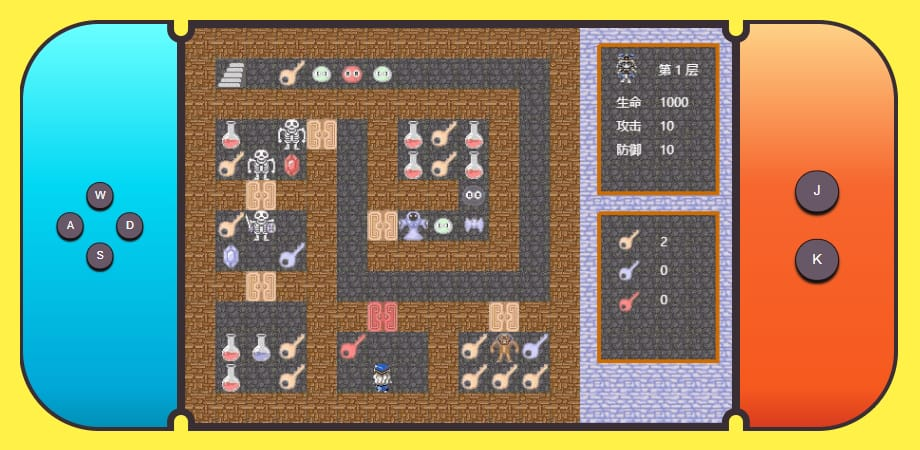

# game-box

## Introduction

~~to make some...~~

莫名其妙从麦趣鸡盒联想到了游戏盒，就感觉很有意思于是有了这个游戏盒。

计划为这个游戏盒添加一些诸如魔塔、flappy board之类的经典小游戏。

既然是麦趣鸡盒，会原生去实现体积大概会小一点，大概。

<br>

## preview

### [click here](https://jerryfangr.github.io/game-box/dist/index.html)


* **Tower**

  

<br>


## install(for dev)

1. **download or clone this project**

2. **enter the root directory**

3. **run shell**

   * ```bash
     npm i
     ```

     **or**

   * ```bash
     yarn
     ```

<br>

## progress

1. **魔塔**

   1. ~~通过载入配置文件地图数组，来自动生成相应元素~~
   2. ~~人物移动~~
   3. ~~人物与地图内元素的碰撞交互判断~~
   4. ~~一次性物品交互与人物属性更新~~
   5. ~~战斗动画~~
   6. ~~楼层切换与切换楼层后人物位置修改至最近地面~~
   7. 与NPC文字对话交互，
   8. 商店面板
   9. 本地存档+配合leanCloud云存档
   10. ...

<br>

## TODO

1. 简易项目文件
   1. 用例
   2. 线框
   3. ...
